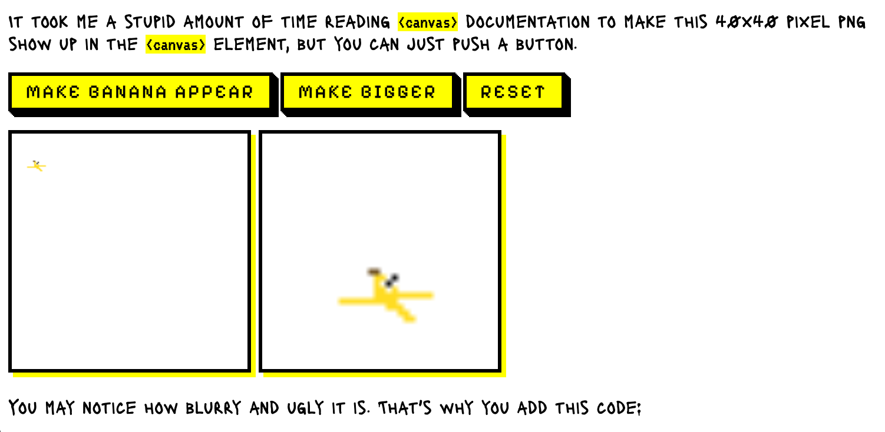

# banana-canvas

[See interactive devlog here](https://ebccoats.github.io/banana-canvas/) - the devlog IS the project

I thought it would be an interesting idea to do a devlog where all the frustrating steps and confusing bugs could be vicariously experienced by readers who don't necessarily know how to code. The code is ugly but I'm really pleased that I was able to reproduce the most confusing bug I ran into, which is the var thing when the banana becomes a baby. That code is in [script-2-13-25.js](https://github.com/ebccoats/banana-canvas/blob/main/scripts/script-2-13-25_1.js) from around line `126` to `168`. At one point the bug broke, and it was funny to realize I was trying to debug why a bug wasn't working anymore and reimplement the bug. 

